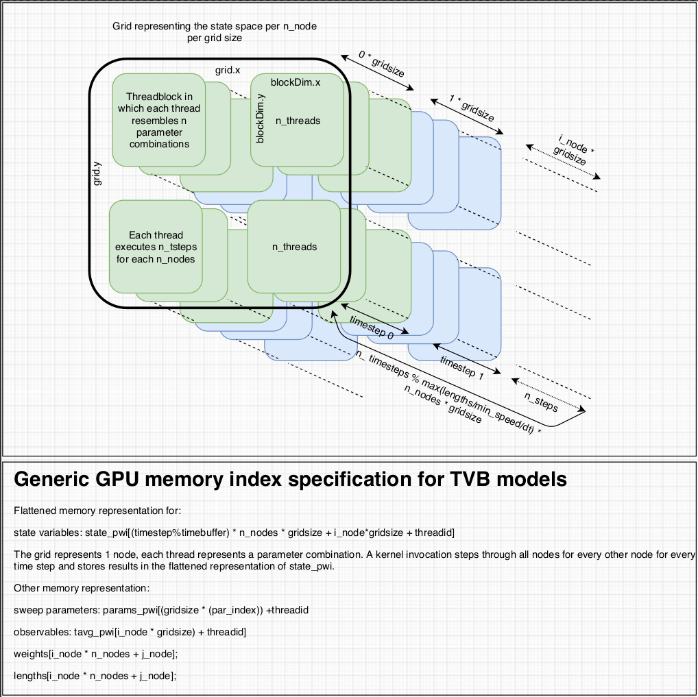

# TVB CUDA model generation using LEMS format
This readme describes the usage of the code generation for models defined in LEMS based XML to Cuda (C) format.
The LEMS format PR has been adopted and altered to match TVB model names. 
In LEMSCUDA.py the function "cuda_templating(Model+'_CUDA')" will start the code generation.
It expects a [model+'_CUDA'].xml file to be present in tvb/dsl_cuda/NeuroML/XMLmodels. 
The generated file will be placed in tvb/simulator/models.
The produced filename is a lower cased [model].py which contains a class named [model].
In the directory TVB_testsuite the files to run the models on the GPU can be found.
Execute './runthings cuda Modelname' to start the parameter sweep based simulation.

    .. moduleauthor:: Michiel. A. van der Vlag <m.van.der.vlag@fz-juelich.de>
    
# The CUDA memory model specification


# Files
* dsl_cuda/LEMS2CUDA.py   				: python script for initiating model code generation
* dsl_cuda/NeuroML/XMLmodels            : directory containing LEMS based XML model files
* dsl_cuda/tmpl8_CUDA.py 				: Mako template converting XML to CUDA
* dsl_cuda/NeuroML/lems                 : modified pyLEMS library tuned for TVB CUDA generation
* dsl_cuda/NeuroML/lems/component.py    : maintains constants and exposures
* dsl_cuda/NeuroML/lems/dynamics.py     : maintains all dynamic attributes
* dsl_cuda/NeuroML/lems/LEMS.py         : LEMS XML file parser
* dsl_cuda/NeuroML/lems/expr.py         : expression parser
* dsl_cuda/TVB_testsuite/               : directory for run parameter based GPU with generated model

# Prerequisites
Mako templating

# XML LEMS Definitions 
Based on http://lems.github.io/LEMS/elements.html but attributes are tuned for TVB CUDA models.
As an example an XML line and its translation to CUDA are given. 

* Constants\
If domain = 'none' no domain range will be added.\
Label is fixed to ':math:constant.name'

```xml
<Constant name="x0" domain="" default="-1.6" description="Epileptogenicity parameter."/>
```
translates to:
```c
const float x0 = -1.6;
```

* State variables
State variable ranges [lo, hi]" values are entered with keyword "boundaries" with a comma separator.\
The default option can be used to initialize if necessary (future)
For each state variable a set of boundaries can be added to encompass the dynamic range.\
A wrapping function according to the values entered will be generated and in numerical solving the wrapper 
will be applied. \

```xml
<StateVariable name="x1" default="0.0" boundaries="-2., 1."/>
```
translates to:
```c
    __device__ float wrap_it_x1(float x1)
{
    int x1dim[] = {-2.0, 1.0};
    if (x1 < x1dim[0]) x1 = x1dim[0];
    else if (x1 > x1dim[1]) x1 = x1dim[1];

    return x1;
}

    double x1 = 0.0;
    
    for(nsteps)
        for(inodes)
            x1 = state((t) % nh, i_node + 0 * n_node);
```

* Exposures\
Exposures are used for observables and translate to variables_of_interest.\
For the name enter variable to be observed (usually states).\
The field 'choices' are treated as lists with a (,) separator.\
The define is hardcoded for the the term tavg.\
Tavg is the datastruct containing the results of the parameter sweep simulation.

```xml
 <Exposure name="o_x1" choices="x1"/>
```
translates to:
```c
#define tavg(i_node) (tavg_pwi[((i_node) * size) + id])
tavg(i_node + 0 * n_node) = x1;
```

* Derived variables\
DerivedVariables can be used to 'easify' the time derivatives, enter the local coupling formulas or any formula.\
sytax: [name]=[expression].\
Define for example global and local coupling: c_0 = coupling.\
            
```xml
<DerivedVariable name="c_pop1" expression="coupling[0]"/>
```
translates to:
```c
c_pop1 = coupling[0]
```

* Conditional Derived Variables\
ConditionalDerivedVariables are used to created if, else constructs.\
Use &lt(=); or &gt;(=) for less- or greater then (equal to).\
Syntax: if {condition} -> {cases[0]} else {cases[1]}. Cases are separated by (,).\
It will not produce an else if {cases[1]} is not present.
```xml
<ConditionalDerivedVariable name="ydot0" condition="x1 &lt; 0.0" cases="-a * x1**2 + b * x1, slope - x2 + 0.6 * (z - 4)**2 "/>
```
translates to:
```c
if (x1 < 0.0):
    ydot0 = -a * x1**2 + b * x1
else:
    ydot0 = slope - x2 + 0.6 * (z - 4)**2
```

* Time Derivatives\
Used to define the models derivates functions solved numerically.\
Syntax: dx[n] = {expression}. Name field is not used.
```xml
<TimeDerivative name="V" expression="tt * (y1 - z + Iext + Kvf * c_pop1 + ydot0 * x1)"/>
<TimeDerivative name="W" expression="..."/>
```
translates to:
```c
V = tt * (y1 - z + Iext + Kvf * c_pop1 + ydot0 * x1)
W = ...
```

* Coupling function\
For the coupling function a new component type can be defined.\
The dynamics can be defined with attributes similar to the solving of the numerical analysis.\

```xml
<ComponentType name="coupling_function_pop1">

<!--        Added function for pre and post synaptic activity. Fixed the power being **, however no parse checks for it-->

    <Constant name="c_a" domain="lo=0.0, hi=10., step=0.1" default="1" description="Rescales the connection strength."/>

        <!-- variable for pre synaptic function, only 1 param is allowed (and should be sufficient))  -->
        <!-- the dimension param indicates the nth statevariable to which the coupling function should apply  -->
        <!-- param name appears in the pre or post coupling function.  -->
    <Parameter name="x1_j" dimension='0'/>

    <Dynamics>
        <DerivedVariable name="pre" expression="sin(x1_j - x1)" description="pre synaptic function for coupling activity"/>
        <DerivedVariable name="post" expression="c_a" description="post synaptic = a * pre"/>
    </Dynamics>
        <!-- Handle local coupling result, full expression is c_0 *= 'value'. Name option is hardcoded -->
        <DerivedParameter name="c_pop1" expression="global_coupling * coupling" value="None"/>

    </ComponentType>
```
translates to:
```c
for (unsigned int j_node = 0; j_node < n_node; j_node++)
    {
        //***// Get the weight of the coupling between node i and node j
        float wij = weights[i_n + j_node]; // nb. not coalesced
        if (wij == 0.0)
            continue;

        //***// Get the delay between node i and node j
        unsigned int dij = lengths[i_n + j_node] * rec_speed_dt;

        //***// Get the state of node j which is delayed by dij
        float x1_j = state(((t - dij + nh) % nh), j_node + 0 * n_node);

        // Sum it all together using the coupling function. Kuramoto coupling: (postsyn * presyn) == ((a) * (sin(xj - xi))) 
        coupling += c_a * sin(x1_j - x1);

    } // j_node */

    // rec_n is used for the scaling over nodes
    c_pop1 = global_coupling * coupling;
    c_pop2 = g;
```


# Running
Place model file in directory and execute cuda_templating('modelname') function. Resulting model will be
placed in the CUDA model directory

# TODO
Add CUDA model validation tests.